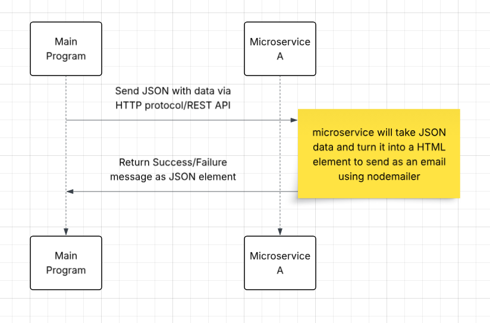

# Communication Contract

### Requesting data from Microservice A

To request data from Microservice A, use an HTTP POST request on port 5013. The request body must include JSON with the following form data: name, email, amount, category, street, city, state, postalCode

```
const res = await fetch('http://localhost:5013/receipt', {
    method: 'POST',
    headers: {
        'Content-Type': 'application/json',
    },
    body: JSON.stringify(formData),
});
```

### Receiving data from Microservice A

Microservice A will send an email and return a success or failure message. The returned data will be in the form of a JSON with the following elements: message and error. This message can displayed in anyway that is desired, such as an alert or an HTML element on the DOM.

```
const result = await res.json();
```

### UML Diagram

